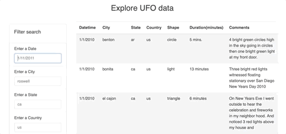

# Javascript and DOM manipulation

The project is focused on the following points:
* Writing a javascript code that create a table dynamically based upon a [dataset](UFO-level-2/static/js/data.js)
* Allow users to filter the table data for specific values(multiple filters).

## Features

* Use of vanilla Javascript
* Use of D3.js

## Built with

* Javascript
* D3.js
* HTML
* CSS
* Bootstrap

## Outcomes

Here you can check the functionality of the website

